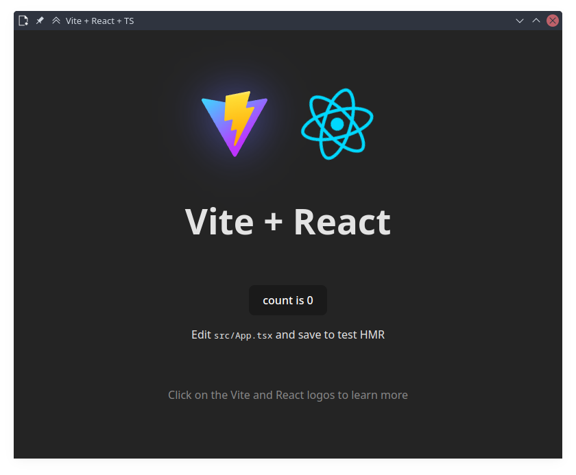

# About
This project was made primarily for learning purposes. It is my attempt at creating a React template for future Electron.js projects. The goal was to create a template without relying too much existing templates. Everyone is welcome to use it as a starting point for their own projects.

At it's core, this project is a combination of the following starting points:
  * [Electron Forge](https://www.electronforge.io/) (Vite + TypeScript)
  * [Vite](https://vitejs.dev/) (React + TypeScript)


# Guide
The project is intended as a template to speed up the set up step for electron projects. Should you prefer to recreate the development process yourself, perhaps for learning or customization purposes, the following details have been provided for you.

1. [Steps to manually recreate the template](#steps-to-manually-recreate-the-template)
2. Recommended continuation:
    * [Organize 'main' process functions directory](./guides/organize-main-function-directory.md) **(recommended)**
    * Setting up Electron API as functions
        1. Main process
            * [dialog](./guides/electron-api-functions/main-process/dialog-guide.md) (Also serves as the **general guide** on **how to include APIs that require function arguments**)
    * Setting up Node API as functions
        * [file system (node:fs)](./guides/node-API-functinos/file-system-guide.md) (UNFINISHED BROKEN LINK) (**Serves as the general guide on how to include node API into the template**)
    * Setting up custom utility functions
      * [fileTypeValidation]() (UNFINISHED BROKEN LINK) **Serves as the general guide on how to include additional packages into the template**)
      * [directoryValidation]() (UNFINISHED BROKEN LINK)
    * [Global types for 'main' process IPC functions]() (UNFINISHED BROKEN LINK) **(recommended)**
    * [Extract 'main' process IPC event listeners to an external file]() (UNFINISHED BROKEN LINK) **(recommended)**


The additions included in the "Recommended continuation" are part of the project by default, and they should follow after the steps to manually recreate the template. However, note that the latest template contains mode functions that what's covered in the guides.

The selection of functions are not extensive. They were selected based on my project needs. You're encouraged to modify add your own functions by following the same steps described in the guide.


# Steps to manually recreate the template
### 1. Generate an Electron Forge project as the template's base
Generate a new `Electorn Forge` project using the `vite-typescript` template with the following command.

```bash
npm init electron-app@latest <name-of-electron-forge-project> -- --template=vite-typescript
```

*Be sure to change &lt;name-of-the-project&gt; with your intended project name.*


### 2. Organize the Electron Forge project files
Move the following files into the specified locations. Create the folders as necessary

| Original file location  | New file location |
|------------------------ | ----------------- |
| `src/main.ts` | move to `src/main/main.ts` |
| `src/preload.ts` | move to `src/preload/preload.ts` |
| `src/renderer.ts` | move to `src/renderer/renderer.ts` or delete |
| `src/index.css` | move to `src/renderer/index.css` or delete |

This step is primarily for organization purposes and separation of contexts. The usefulness of this distinction becomes more apparent once you start to create files that are exclusively used by one of the three contexts (`main`, `preload`, and `renderer`).

> [!NOTE]
> * Once we're already working with React, the `renderer.ts` and `index.css` files are no longer needed, and can be deleted. However, you may still retain these files if you wish to work with vanilla JavaScript/TypeScript instead of React.
> * Once React has been set up, you will see how the `main.tsx` and `App.tsx` serve the same purpose as what `renderer.ts` was intended for, rendering the UI.

Because we changed where files are located in our *electron-forge-project*, this must be reflected in `forge.config.ts`. Look for the part of the file that's similar to the following and update it to match accordingly:

```TS
  build: [
    {
      entry: "src/main/main.ts",
      config: "vite.main.config.ts",
    },
    {
      entry: "src/preload/preload.ts",
      config: "vite.preload.config.ts",
    },
  ],
  renderer: [
    {
      name: "main_window",
      config: "vite.renderer.config.ts",
    },
  ],
```

Additionally, update `vite.renderer.config.ts` to have the following `base`

```TS
  base: "./renderer",
```


### 3. Generate a React-TS project using Vite, and copy files from it
In a different folder, create a new instance of a `vite` project with the `react-ts` template using the following command:

```bash
npm create vite@latest <name-of-vite-project> -- --template react-ts
```

*Be sure to change change &lt;name-of-the-project&gt; with your intended folder name. The name for this isn't important as we'll simply moves files out of this folder.*


#### <u>**Copy `tsconfig.json` details**</u>

Update `tsconfig.json` in the *electron-forge-project* to include the following. These are taken from the `tsconfig.app.json` and `tsconfig.node.json` of the *vite-project*.

```json
  // added specifically for React
  "jsx": "react-jsx",

  // linting
  "strict": true,
  "noUnusedLocals": true,
  "noUnusedParameters": true,
  "noFallthroughCasesInSwitch": true
```

The above specifications are those that don't conflict with the *electron-forge-project*'s set-up based on manual trial-and-error testing.


#### <u>**Copy files, directories, and packages from the *vite-project* into the *electron-forge-project***</u>

Do the following actions for the specific files and directories from the `vite-project`:

|File/Directory | Action |
|---------------|--------|
|`public/`| Copy to root directory of the *electron-forge-project*|
|`.gitignore`| Copy the lines that aren't present inside the *electron-forge-project* `.gitignore` file. |
| `src/` | Move the files into the `renderer/` folder of the *electron-forge-project* |
| `index.html` | Replace the `index.html` of the *electron-forge-project*. <br><br> Be sure to update the <br>`<script type="module" src="/src/main.tsx"></script>` <br> to <br>`<script type="module" src="/src/renderer/main.tsx"></script>` <br> so the HTML knows where to look for our `main.tsx` file|
| `package.json` | Use the `npm install <package-name>` to install the listed `dependencies` and `devDependencies` packages from the *vite-project* `package.json`. This should automatically resolve potential dependency conflicts. <br><br> Note that not all packages used by *electron-forge-project* will be used in the *vite-project*. You may run `npx depcheck` to list unused packages remove them. <br><br> You may also use this opportunity to update the details of project specified in the *electron-forge-project* `package.json`.|

As of writing (**Aug 15, 2024**), a new `vite` project using the `react-ts` template includes the following packages:

```JSON
  "dependencies": {
    "react": "^18.3.1",
    "react-dom": "^18.3.1"
  },
  "devDependencies": {
    "@eslint/js": "^9.8.0", // can be skipped (unused)
    "@types/react": "^18.3.3",
    "@types/react-dom": "^18.3.0",
    "@vitejs/plugin-react": "^4.3.1", // can be skipped (unused)
    "eslint": "^9.8.0",
    "eslint-plugin-react-hooks": "^5.1.0-rc.0", // can be skipped (unused)
    "eslint-plugin-react-refresh": "^0.4.9", // can be skipped (unused)
    "globals": "^15.9.0", // can be skipped (unused)
    "typescript": "^5.5.3",
    "typescript-eslint": "^8.0.0",
    "vite": "^5.4.0"
  }
```


#### <u>**Make the *electron-forge-project* recognize our React changes**</u>

In the *electron-forge-project*, update the `src/main/main.ts` to recognize the previously added React files.

Include the following code inside the `createWindow()` function. This allows the *electron-forge-project* to look for the vite live server and render it as the "frontend" of the project. Overwrite the part of the code that's similar to the following:

```TS
  // and load the index.html of the app.
  if (MAIN_WINDOW_VITE_DEV_SERVER_URL) {
    // MAIN_WINDOW_VITE_DEV_SERVER_URL is the localhost
    mainWindow.loadURL(MAIN_WINDOW_VITE_DEV_SERVER_URL);
    console.log(
      `🛜  Loaded through localhost ${MAIN_WINDOW_VITE_DEV_SERVER_URL}`
    );
  } else {
    // MAIN_WINDOW_VITE_NAME is "main_window"
    mainWindow.loadFile(
      path.join(__dirname, `../renderer/${MAIN_WINDOW_VITE_NAME}/index.html`)
    );
    console.log(
      `📁  Loaded through a local file:  ${path.join(
        __dirname,
        `../renderer/${MAIN_WINDOW_VITE_NAME}/index.html`
      )}`
    );
  }
``` 

Also include the following somewhere at the top of the `src/main/main.ts` file to remove the linting error in VS Code that underlines these variables

```TS
declare const MAIN_WINDOW_VITE_DEV_SERVER_URL: string;
declare const MAIN_WINDOW_VITE_NAME: string;
```


### 4. Run the project
You should now be able to run the project using the following commands

```bash
npm run start
```
or
```bash
npm start
```

