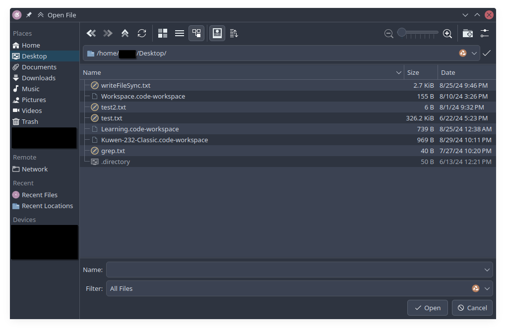

# Electron `dialog` API

### Introduction:
This guide will cover how to incorporate the `showOpenDialog()` of the [electron dialog API](https://www.electronjs.org/docs/latest/api/dialog). It goes over creating a **function for opening files** and another **function for opening directories**. The functions will be generalized to accept the arguments of `showOpenDialog()` specified in the [electron dialog API documentatoin](https://www.electronjs.org/docs/latest/api/dialog). It also covers how to route the functions from the 'main' process to 'renderer' process via the IPC.

> [!IMPORTANT]
> Although this guide discusses the details of incorporting the electron `dialog` API, the general approach covered here can be used to adapt other electron APIs into the electron project template.

### Directory:
1. [Guide](#guide)
    1. [Prepare the `dialog.ts` file](#1-prepare-the-dialogts-file)
    2. [Prepare handling of just created functions](#2-prepare-handling-of-the-just-created-dialog-functions-maintsipchandlerts)
    3. [Route the `dialog` functions through the IPC `preload.ts`](#3-route-the-dialog-functions-through-the-ipc-preloadts)
    4. [Call the functions on the 'renderer' process](#4-call-the-dialog-function-from-the-renderer-process-part-of-the-electron-project)
2. [Appendix](#appendix)


# Guide

### 1. Prepare the `dialog.ts` file

> [!TIP]
> <b><u>Recommended prerequisite</u></b>:
> Although not required, I highly recommend first [organizing the 'main' process functions directory](../../organize-main-function-directory.md).

Navigate to your where you store your 'main' process functions. If you followed the recommended ['main' process functions organization](../../organize-main-function-directory.md), this will be the `./src/main/functions/electron` directory. If you didn't follow the above guide, the following can be directly inputted into the `main.ts`.

Create a new file named `dialog.ts` if you're not inputting directly into the `main.ts`. This file will contain everything about the [electron dialog API](https://www.electronjs.org/docs/latest/api/dialog) that we want to include in our project.

Perfom a simple read through of the [electron dialog API](https://www.electronjs.org/docs/latest/api/dialog) documentation to determine which aspects you want to include, and plan how you will incorporate them into your project. This guide will only cover how to include the `showOpenDialog()`.


#### A. <u>Function for opening files dialog:</u>

To start with the function to **opening files**, import `dialog` into the `dialog.ts` (or `main.ts` if you're inputting here) file and create the function for opening files:

```typescript
import { dialog } from "electron";

export async function openFileDialog() {
  const { canceled, filePaths } = await dialog.showOpenDialog({ });
  if (!canceled) {
    return filePaths[0];
  }
}
```

*In the above code, an `await` keyword is used because `dialog.showOpenDialog()` is an asynchronous function. Our `canceled` and `filePaths` variables will be 'undefined' if we don't wait for the process to finish before reading from them*

At this point, if you test our the above function ([after the IPC communication has been set up](#2-prepare-handling-of-the-just-created-dialog-functions-maintsipchandlerts)), you'll find out that you're already able to select files via the operating system's built-in file picker. If a file path is selected before the dialog window is closed, our function will return the corresponding file path of the chosen file.



If this is all you need, you can actually proceed to [preparing how to function is handled](#2-prepare-handling-of-the-just-created-dialog-functions-maintsipchandlerts) while ignoring details that make sure the `showOpenDialog()` arguments can be passed from the 'renderer' to the 'main' process without breaking the function.

Although the above scenario is already quite capable for a variety of use cases, it prevents us from leveraging the full functionality of `showOpenDialog()` described in the [electron dialog API documentation](https://www.electronjs.org/docs/latest/api/dialog). To address this, first set up the our function to accept an object containing the `options` specified in the documentation. Afterwards, pass them as an argument to the `showOpenDialog({})` API.

```typescript
import { dialog } from "electron";

export async function openFileDialog({
  title,
  defaultPath,
  buttonLabel,
  filters,
  properties,
  message,
  securityScopedBookmarks,
}) {
  const { canceled, filePaths } = await dialog.showOpenDialog({
    title,
    defaultPath,
    buttonLabel,
    filters,
    properties,
    message,
    securityScopedBookmarks,
  });
  if (!canceled) {
    return filePaths[0];
  }
}
```

*Read through the details of possible options in the [documentation](https://www.electronjs.org/docs/latest/api/dialog) to get a brief understanding of each option's purpose. You can decide to exclude the ones that seem unecessary to your use case.*

If you're using TypeScript in VS Code, the above will get flagged as an error for not specfying types for the function's arguments. Fortunately, the the options' types are provided in its [documentatoin](https://www.electronjs.org/docs/latest/api/dialog). These can be easily implemented as such...

```typescript
// ...

export type OpenDialogProps = {
  title?: string;
  defaultPath?: string;
  buttonLabel?: string;
  // MacOS: Message to display above input boxes
  message?: string;
  // MacOS & MacAppStore Create security scoped bookmarks when packaged for the Mac App Store.
  securityScopedBookmarks?: boolean;
  filters?: {
    name: string; // ex. EPUB
    extensions: string[]; // ex. ["epub", "zip"] or ["*"] for all files
  }[];
  properties?: (
    | "openFile"
    | "openDirectory"
    | "multiSelections"
    | "showHiddenFiles"
    // MacOS: Allow creating new directories from dialog.
    | "createDirectory"
    // Windows: Prompt for creation if the file path entered in the dialog does not exist.
    | "promptToCreate"
    // MacOS: Selected aliases will now return the alias path instead of their target path.
    | "noResolveAliases"
    // MacOS: Treat packages, such as .app folders, as a directory instead of a file.
    | "treatPackageAsDirectory"
    // Windows: Do not add the item being opened to the recent documents list.
    | "dontAddToRecent"
  )[];
};

export async function openFileDialog({
  // ...
})
```

... and then declare that the function arguments are of the abve `OpenDialogProps` type ...


```typescript
// ...

export async function openFileDialog({
  title,
  defaultPath,
  buttonLabel,
  filters,
  properties,
  message,
  securityScopedBookmarks,
}: OpenDialogProps) {
  // ...
}

// ...
```

At this point, this is actually all we need to have a 'main' process function that opens the OS' built-in file dialog (assuming [proper IPC communication has been set up](#2-prepare-handling-of-the-just-created-dialog-functions-maintsipchandlerts) and [properly formatted arguments are sent from the 'renderer' process](#4-call-the-dialog-function-from-the-renderer-process-part-of-the-electron-project))! We should still get generally same dialog window as before, but with the option to pass arguments that support `showOpenDialog()`'s functionality, such as showing hidden files and specifying a list file types to choose from:


We can further improve this with useful additions to our function. This part is optional if you don't want to distinguish between a dialog window for opening files and a dialog window for opening directories:

```typescript
// ...

export async function openFileDialog({
  // ... 
}) {
  const { canceled, filePaths } = await dialog.showOpenDialog({
    title,
    defaultPath,
    buttonLabel,
    filters: filters?.concat({ name: "All Files", extensions: ["*"] }), // code addition here
    properties: properties ? properties.concat("openFile") : ["openFile"], // code addition here
    message,
    securityScopedBookmarks,
  });
  if (!canceled) {
    return filePaths[0];
  }
}

// ...
```

The addition to `filters` indicates that the `All Files`, which shows all file extensions, should remain a selectable option even when a specific set of file extensions have been specified. The addition to `properties` intructs the function to always use the dialog window for opening files (not directories).

#### B. <u>Function for opening directories via dialog:</u>

To create a separate and dedicated function for **opening directories**, we can follow the same steps we made for the **opening files** because both originate from `showOpenDialog()`. Just make sure to replace `"openFile"` with `"openDirectory"`. Afterward you should get another function inside the `dialog.ts` file (or `main.ts`) that contains the following:

```typescript
export async function openDirectoryDialog({
  title,
  defaultPath,
  buttonLabel,
  filters,
  properties,
  message,
  securityScopedBookmarks,
}: OpenDialogProps) {
  const { canceled, filePaths } = await dialog.showOpenDialog({
    title,
    defaultPath,
    buttonLabel,
    filters: filters?.concat({ name: "All Files", extensions: ["*"] }),
    properties: properties
      ? properties.concat("openDirectory")
      : ["openDirectory"],
    message,
    securityScopedBookmarks,
  });
  if (!canceled) {
    return filePaths[0];
  }
}
```

A completed `dialog.ts` file is provided in the [appendix](#final-dialogts-file) as well as in the [code base](../../../src/main/functions/electron/dialog.ts).

### 2. Prepare handling of the just created `dialog` functions (`main.ts`/`ipcHandler.ts`)
Because of [how electorn works](https://www.electronjs.org/docs/latest/tutorial/process-model), functions on the 'main' process need to get passed through the IPC to be accessible and usable by the 'renderer' process. This is especially true for functions with dependencies that may only work in the 'main' process, such as our `dialog` API that needs to communicate with the OS.

> [!TIP]
> <b><u>Recommended prerequisite</u></b>:
> Although not required, I highly recommend first [extracting 'main' process IPC event listeners to an external file]() (UNFINISHED EMPTYLINK).

Locate where you handle your IPC event listeners on the 'main' process. If you followed the [guide on extracting 'main' process IPC event listeners to an external file]() (UNFINISHED EMPTY LINK), this should be the `./src/main/functions/ipcHandler.ts` file. Otherewise, the IPC event listeners are usually included as part of the `main.ts` file.

In your file, either `ipcHandler.ts` or `main.ts`, import `Event`, `ipcMain` and the previously made `openDirectoryDialog()` and `openFileDialog()` functions:

```typescript
// top of the `./src/main/functions/ipcHandler.ts` or `main.ts` file
import { Event, ipcMain } from "electron";
import {
  openDirectoryDialog,
  openFileDialog,
} from "./functions/electron/dialog";

// change the dialog file location as necessary.
```

Afterwards, use the `ipcMain.handle()` to include event listeners that trigger our functions for specific events. Traditionally, these event listener are placed as part of the the `main.ts` file, inside `createWindow()` ([see reference](https://www.electronjs.org/docs/latest/tutorial/ipc)).


```typescript
// `./src/main/functions/ipcHandler.ts` or `main.ts` file
ipcMain.handle("dialog:openDirectory", openDirectoryDialog);
ipcMain.handle("dialog:openFile", openFileDialog);
```

*The "dialog:openDirectory" and "dialog:openFile" are arbitrary strings that associate events to our functions. As long as you are consistent with how you refer to the functions, these can be any string value.*

So far, this set up would work for simple functions that don't accept arguments. However, since our `openDirectoryDialog()` and `openFileDialog()` functions do expect arguments to set dialog window options, our callback listeners should reflect this. Intuitively, one might update the callback part directly by adding a variable like so:

```ts
// `./src/main/functions/ipcHandler.ts` or `main.ts` file
ipcMain.handle("dialog:openDirectory", openDirectoryDialog(args));
ipcMain.handle("dialog:openFile", openFileDialog(args));
```

If you try to run your project with the above code however, you'll receive an error because `ipcMain.handle()` expects its callback function to have **2 arguments**. The **1st argument** should be of the type `Electron.IpcMainInvokeEvent`, and the **2nd argument** are then the arguments of our original function. This dilema can easily be resolved by wrapping our 'main' process functions inside a wrapper function before passing them on to the event listener:

```ts
// `./src/main/functions/ipcHandler.ts` or `main.ts` file

import { IpcMainInvokeEvent, ipcMain } from "electron";
import {
  openDirectoryDialog,
  openFileDialog,
} from "./functions/electron/dialog";

function ipcEventWrapper<Input, Output>(mainProcessFn: (arg: Input) => Output) {
  return (_event: IpcMainInvokeEvent, args: Input) => mainProcessFn(args);
}

// if working with `./src/main/functions/ipcHandler.ts` wrap the below code in an exportable function and then call it in `main.ts`, inside `createWindow()`.
ipcMain.handle("dialog:openDirectory", ipcEventWrapper(openDirectoryDialog));
ipcMain.handle("dialog:openFile", ipcEventWrapper(openFileDialog));
```

A completed `ipcHandler.ts` file is provided in the [appendix](#final-dialogts-file) as well as in the [code base](../../../src/main/ipcHanlder.ts).


### 3. Route the `dialog` functions through the IPC `preload.ts`
After all that, you now have to make the `openDirectoryDialog()` and `openFileDialog()` functions accessible to the  'renderer' process side of electron. 

Locate your `preload.ts` and expose your functions as such:

```ts
// `./src/preload/preload.ts`
import { contextBridge, ipcRenderer } from "electron";
import { OpenDialogProps } from "../main/functions/electron/dialog";

// the arguments need to be deconstructed ({ ...args }) for this to work

contextBridge.exposeInMainWorld("electron", {
  openFile: (args?: OpenDialogProps) => ipcRenderer.invoke("dialog:openFile", { ...args }),
  openDirectory: (args?: OpenDialogProps) => ipcRenderer.invoke("dialog:openDirectory", { ...args }),
});
```

In the above code, the `contextBridge.exposeInMainWorld()` exposes our function to make it accessible. The first `string` variable agrument (*"electron"*), serves as the access point to our function on the 'renderer' side of electron. By default, this will make our functions accessbile through the `window` object via `window.electron.[name_of_function]`. The names of the functions are the `key-values` provided as part of the second argument to `contextBridge.exposeInMainWorld()` (*openFile* and *openDirectory*). Hence, the proper calls to our function on the 'renderer' process will be `window.electron.openFile()` and `window.electron.openDirectory()`.

The `ipcRenderer.invoke()` calls on the our function in the 'main' process via the handler we made previously. Make sure that the arbitrary strings used in the `preload.ts` matches the corresponding strings used in `ipcHandler.ts`/`main.ts`. It is also important to note that the arguments being passed need to be deconstructured ({ ...args } )for the function call to work properly.


### 4. Call the `dialog` function from the 'renderer' process part of the electron project.
Anywhere in the 'renderer' process, you can call the functions similar to the following:

```ts
// examples:
const zipFilePath = await electron.openFile();
const extractPath = await electron.openDirectory();

const epubPath = await electron.openFile({
        filters: [{ name: "EPUB", extensions: ["epub", "zip"] }],
      });
```

Lastly, note that, based on experience, adding the `await` keyword before the function call, even if functions themselves aren't asynchronous, can help limit unexpected behaviors.


# Appendix
#### <u>Final `dialog.ts` file</u>
```typescript
// For  more detailed reference, refer to the official documentation:
// https://www.electronjs.org/docs/latest/api/dialog#dialogshowopendialogwindow-options

// file: src/main/functions/electron/dialog.ts

import { dialog } from "electron";

export type OpenDialogProps = {
  title?: string;
  defaultPath?: string;
  buttonLabel?: string;
  // MacOS: Message to display above input boxes
  message?: string;
  // MacOS & MacAppStore Create security scoped bookmarks when packaged for the Mac App Store.
  securityScopedBookmarks?: boolean;
  filters?: {
    name: string; // ex. EPUB
    extensions: string[]; // ex. ["epub", "zip"] or ["*"] for all files
  }[];
  properties?: (
    | "openFile"
    | "openDirectory"
    | "multiSelections"
    | "showHiddenFiles"
    // MacOS: Allow creating new directories from dialog.
    | "createDirectory"
    // Windows: Prompt for creation if the file path entered in the dialog does not exist.
    | "promptToCreate"
    // MacOS: Selected aliases will now return the alias path instead of their target path.
    | "noResolveAliases"
    // MacOS: Treat packages, such as .app folders, as a directory instead of a file.
    | "treatPackageAsDirectory"
    // Windows: Do not add the item being opened to the recent documents list.
    | "dontAddToRecent"
  )[];
};

export async function openFileDialog({
  title,
  defaultPath,
  buttonLabel,
  filters,
  properties,
  message,
  securityScopedBookmarks,
}: OpenDialogProps) {
  const { canceled, filePaths } = await dialog.showOpenDialog({
    title,
    defaultPath,
    buttonLabel,
    filters: filters?.concat({ name: "All Files", extensions: ["*"] }),
    properties: properties ? properties.concat("openFile") : ["openFile"],
    message,
    securityScopedBookmarks,
  });
  if (!canceled) {
    return filePaths[0];
  }
}

export async function openDirectoryDialog({
  title,
  defaultPath,
  buttonLabel,
  filters,
  properties,
  message,
  securityScopedBookmarks,
}: OpenDialogProps) {
  const { canceled, filePaths } = await dialog.showOpenDialog({
    title,
    defaultPath,
    buttonLabel,
    filters: filters?.concat({ name: "All Files", extensions: ["*"] }),
    properties: properties
      ? properties.concat("openDirectory")
      : ["openDirectory"],
    message,
    securityScopedBookmarks,
  });
  if (!canceled) {
    return filePaths[0];
  }
}
```

#### <u>Final `handler.ts` file</u>
```ts
import { IpcMainInvokeEvent, ipcMain } from "electron";
import {
  openDirectoryDialog,
  openFileDialog,
} from "./functions/electron/dialog";

// Wraps the 'main' process functions into a function that accepts electron
//  events of the type IpcMainInvokeEvent while allowing inputs from the
//  'renderer' process side of the application
function ipcEventWrapper<Input, Output>(mainProcessFn: (arg: Input) => Output) {
  return (_event: IpcMainInvokeEvent, args: Input) => mainProcessFn(args);
}

// The following functions were originally part of the the 'main.ts' file.
//    Along with the 'preload.ts', these functions are what allow the
//    'main' and 'renderer' processes to interact.
export default function ipcHandler() {
  // IPC communication - electron:dialog
  ipcMain.handle("dialog:openDirectory", ipcEventWrapper(openDirectoryDialog));
  ipcMain.handle("dialog:openFile", ipcEventWrapper(openFileDialog));
}

```