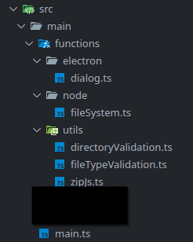

# Organize 'main' process functions directory
For better organization and separation of concerns, create a `functions` folder under `src/main` with the following sub-folders:
* `functions/electron` - for functions originating from the [electron API](https://www.electronjs.org/docs/latest/api/app)
* `functions/node` - for functions originating from the [node API](https://nodejs.org/docs/latest/api/)
* `functions/utils` - for custom utility functions we want to include

The `functions/utils` folder is intended for functions, often custom, that aren't covered by the electron and node API. These are likely to be utility functions derived from imported node/npm packages or are entirely hand-made functions.

Feel free to add additional folders for greater specificity for your projects.

Later on, once you have function files in your `src/main` folder, it should should something look like the following:

